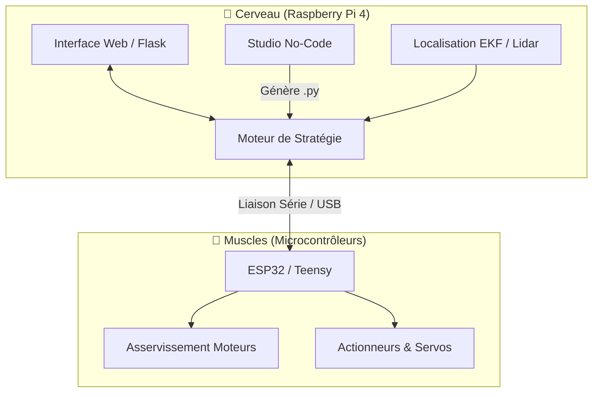

# 🏰 Robot Eirbot - Eurobot 2026 : The Two Towers


> **Code source officiel du robot de l'association Eirbot pour la Coupe de France de Robotique 2026.**
> Une architecture hybride alliant la puissance de calcul d'une Raspberry Pi pour la stratégie et la réactivité de microcontrôleurs pour l'asservissement.

---

## 📑 Sommaire

1. [Architecture Globale](#-architecture-globale)
2. [Fonctionnalités Clés](#-fonctionnalités-clés)
3. [Structure du Projet](#-structure-du-projet)
4. [Installation & Démarrage](#-installation--démarrage)
5. [Hardware](#-hardware)
6. [Licence](#-licence)

---

## 🏗 Architecture Globale

Le robot repose sur une communication **Haut Niveau (High-Level)** et **Bas Niveau (Low-Level)**.



## 🚀 Fonctionnalités Clés

### 🎨 Studio de Stratégie "No-Code"

Plus besoin de recompiler le code entre deux matchs !

- Interface Blockly intégrée hébergée sur le robot.
- Création de stratégies en Drag & Drop.
- Simulateur 2D temps réel pour valider les déplacements avant le match.

### 🌐 Dashboard de Contrôle

- Interface Web accessible via Wi-Fi (`http://<ip_robot>:5000`).
- Retour vidéo, état des capteurs, scores et logs en direct.
- Lancement et arrêt d'urgence à distance.

### 📍 Navigation Avancée

- Fusion de Capteurs : Filtre de Kalman Étendu (EKF) combinant odométrie et Lidar.
- Trajectoires Courbes : Génération de chemins fluides via courbes de Bézier.
- Évitement dynamique des adversaires.

---

## 📂 Structure du Projet

L'arborescence est divisée pour séparer clairement les responsabilités :

```
robot_3a_2026/
├── 🐍 Rasp/                   # --- HAUT NIVEAU (Python) ---
│   ├── ihm/                   # Serveur Web, Dashboard et Blockly
│   ├── LiDAR/                 # Drivers Lidar et Algorithmes de localisation
│   ├── strat/                 # Logique de match, automates et actions
│   ├── interface_deplacement/ # Pathfinding et communication Série
│   ├── utils/                 # Gestion Audio, LEDs, Caméra
│   └── main_robot.py          # Point d'entrée principal
│
├── ⚡ src/                    # --- BAS NIVEAU (C++ / PlatformIO) ---
│   ├── ClassMotors.cpp        # Asservissement PID vitesse/position
│   ├── ClassActionneur.cpp    # Gestion des pinces et servos
│   └── main_motor.cpp         # Boucle principale du microcontrôleur
│
├── 📄 docu/                   # Documentation, règles et datasheets
└── ⚙️ platformio.ini          # Configuration de compilation C++
```

---

## 🛠 Installation & Démarrage

### 1. Prérequis Raspberry Pi (Cerveau)

Le code Python nécessite Python 3.9+.

```bash
# Cloner le dépôt
git clone https://github.com/ton-repo/robot_3a_2026.git
cd robot_3a_2026/Rasp

# Installer les dépendances
pip install -r requirements.txt

# Lancer le robot (Stratégie + Serveur Web)
python main_robot.py
```

L'interface est ensuite accessible sur le port 5000.

### 2. Prérequis Microcontrôleur (Muscles)

Le code bas niveau utilise PlatformIO.

- Installer VSCode.
- Installer l'extension PlatformIO IDE.
- Ouvrir le dossier racine du projet.
- Connecter la carte via USB et cliquer sur le bouton Upload (flèche droite) dans la barre d'état.

---

## 🔧 Hardware

| Composant | Modèle | Rôle |
|-----------|--------|------|
| Ordinateur de bord | Raspberry Pi 4B | Intelligence, Vision, Web |
| Microcontrôleur | ESP32 / Teensy 4.1 | Gestion temps réel, PWM, Encodeurs |
| Lidar | RPLIDAR C1 / M1 | Détection d'obstacles et recalage |
| Moteurs | DC avec Encodeurs | Propulsion |
| Actionneurs | Servomoteurs AX-12 / Dynamixel | Manipulation des éléments de jeu (Tour) |

---

## 📜 Licence

Ce projet est sous licence Apache License 2.0.

Copyright 2025-2026 Équipe Eirbot.

Licensed under the Apache License, Version 2.0 (the "License"); you may not use this file except in compliance with the License. You may obtain a copy of the License at

http://www.apache.org/licenses/LICENSE-2.0

Unless required by applicable law or agreed to in writing, software distributed under the License is distributed on an "AS IS" BASIS, WITHOUT WARRANTIES OR CONDITIONS OF ANY KIND, either express or implied. See the License for the specific language governing permissions and limitations under the License.